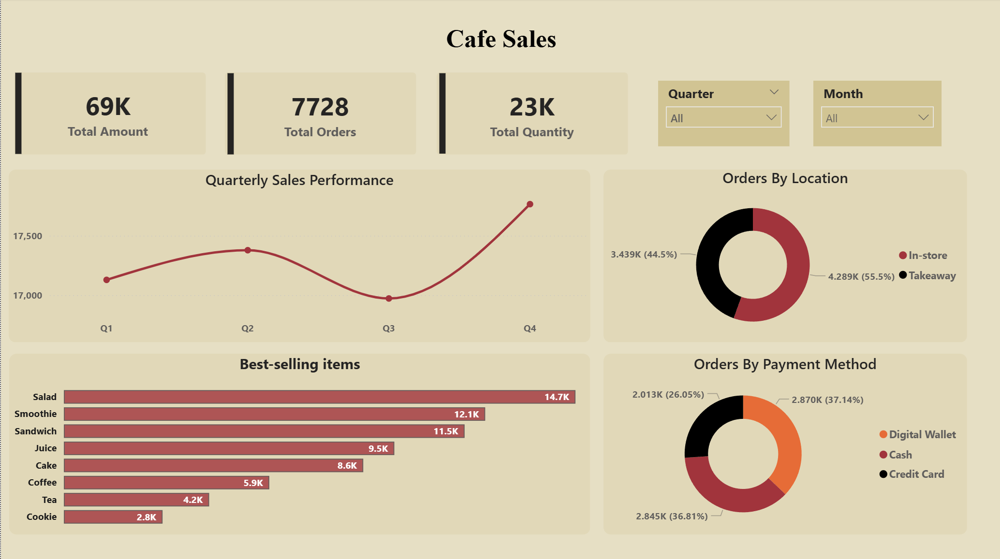

# ☕ Cafe Sales Forecasting & BI Analysis (Python & Power BI)

## 📌 Project Overview
This project presents an **end-to-end analytics solution** for a local café's transactional data. It integrates advanced **Machine Learning (ML)** techniques for predictive sales forecasting with **Power BI** for interactive data visualization and historical performance analysis.

The aim is to transform raw sales data into actionable business intelligence, helping the café understand revenue drivers, seasonality, and customer behavior.

## 📦 Dataset Source

The raw data utilized for this analysis and modeling comes from the following public source:

 [Kaggle Dataset](https://www.kaggle.com/datasets/ahmedmohamed2003/cafe-sales-dirty-data-for-cleaning-training/data)
 
## 🛠️ Technology Stack
* **Data Cleaning & Modeling:** Python (Google Colab, Pandas, NumPy)
* **Predictive Models:** Scikit-learn, **XGBoost**, Linear Regression, K-Nearest Neighbors (KNN)
* **Visualization & BI:** Microsoft Power BI Desktop (DAX, Power Query)

## 🚀 Key Objectives & Insights

The analysis successfully addressed critical business questions and provided the following actionable insights:

| Focus Area | Key Finding |
| :--- | :--- |
| Sales Forecasting | Utilized XGBoost to develop a high-accuracy model for predicting future revenue and identifying key feature importance. |
| Seasonality | Confirmed strong sales seasonality with peaks in **Q4** and the month of **June**, which is vital for planning and inventory management. |
| Revenue Drivers | **Salad, Smoothie, and Sandwich** are the top three items driving revenue contribution. |
| Customer Behavior | **Takeaway** orders dominate total sales volume, and the **Digital Wallet** is the most preferred payment method across transactions. |

## 📁 Repository Structure & Files

The repository contains the following core files, enabling full project reproducibility:

| File Name | Description |
| :--- | :--- |
| **`cafe_sales.ipynb`** | **Python Notebook (Google Colab):** Contains all steps for data cleaning, feature engineering, ML model building, comparison, and forecasting. |
| **`cafe_sales.pbix`** | **Power BI Dashboard:** The final interactive report with calculated DAX measures, time dimensions, and visualizations. |
| `Cafe_Sales-Dashboard.png` | (A visual snapshot of the final Power BI dashboard for quick viewing). |

## 📊 Dashboard Visuals 

---

### 📧 Contact
Created by **[Khalid Alammari]** - Connect with me on [linkedin.com/in/khalid-alammari-]
 or Email [Khalid.A.Alammari@gmail.com]

